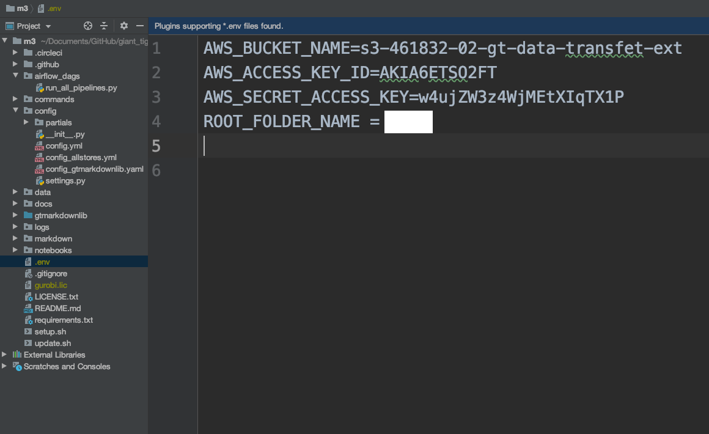

Copyright © 2021 by Boston Consulting Group. All rights reserved

# Installation and Running Guide

The following instructions will enable a user to run the code from end to end from the command line. 

Table of Contents
=================

- [Step 1: Environment Setup](#step-1-environment-setup)
- [Step 2: Create a `.env` file for storing secret access keys](#step-2-create-a-env-file-for-storing-secret-access-keys)
- [Step 3: Running all the Pipelines](#step-3-running-all-the-pipelines)


## Step 1: Environment Setup

### Requirements

* Linux based machine (Installing on Windows machine requires a lot of manual efforts to recreate what is happening in `setup.sh`)
* Python 3.7
* [Git](https://git-scm.com/downloads) (Not required if not using Git)
* [PyCharm](https://www.jetbrains.com/pycharm/) or [Visual Studio Code](https://code.visualstudio.com/)
* Access to Storage, see the [Infrastructure Guide](INFRASTRUCTURE_GUIDE.md)
* Access to [Github Repo](https://github.gamma.bcg.com/gianttiger/m3), see the [Infrastructure Guide](INFRASTRUCTURE_GUIDE.md) for access (Not required if not using Git)

### Installing virtualenv and all dependencies

1. Clone the repository, either by creating a [personal access token](https://docs.github.com/en/free-pro-team@latest/github/authenticating-to-github/creating-a-personal-access-token), [SSH key](https://docs.github.com/en/free-pro-team@latest/github/authenticating-to-github/connecting-to-github-with-ssh), or through built-in [IDE GitHub login features](https://www.jetbrains.com/help/pycharm/github.html). (Not required if you already have a zipped version of the repository from the code owner).

2. Move into the project root directory 

3. Create a virtual environment and install all requirements from `requirements.txt`


## Step 2: Create a `.env` file for storing secret access keys

- Create a new file and name it `.env`. The `.env` file should be located in the `project_starter/` directory.

- The environment variables are in the `.env` file and contain the keys for accessing Storage and other resources.
This file **should not** be committed to the GitHub repository as it contains sensitive information, and should instead
be received from your project lead.

Environment variable | Description | Example
--- | --- | ---
AWS_BUCKET_NAME | AWS Bucket name. | `s3-bucket-name`
AWS_ACCESS_KEY_ID | AWS BUCKET Access Key ID. |  AKBF4ETSO25CZIHMLQOJ
AWS_SECRET_ACCESS_KEY | AWS Bucker Secret Access Key. | nX2T3iRCcn2RiK4P9rE71DZf0niWC+SLIO6rsDO6
ROOT_FOLDER_NAME | The root_folder on s3 bucket in which all the output files from the pipeline are created. Please refer to [INFRASTRUCTURE_GUIDE](INFRASTRUCTURE_GUIDE.md) for more details | `dev_<your_name>`

- Sample `.env` file \


## Step 3: Running all the Pipelines

- Ensure that your current working directory is in the `root` folder i.e. the root directory. `pwd` linux command output on my machine is the following
  ```shell
  (venv) ➜  project_starter git:(master) pwd
  /Users/mohtamadhukar/PycharmProjects/project_starter
  ```
- Ensure that the virtual environment is activated. 

- Run the command `python -m project_starter_lib.main_runner` from the terminal to run all the pipelines.  
 If you want, you can also setup a Pycharm run configuration. [PyCharm Run Configurations](https://www.jetbrains.com/help/pycharm/creating-and-editing-run-debug-configurations.html)

- If you want to run only specific pipelines, you can provide them as a command line argument. 
  
  Example.
  `python -m project_starter_lib.main_runner -p ingest_source_data -p agg_data`
   
  The different pipelines in the system are : 
  - ingest_source_data 
  - agg_data 

